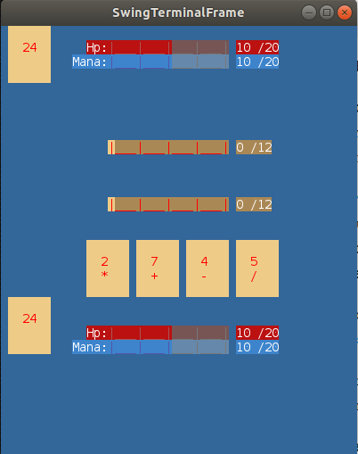
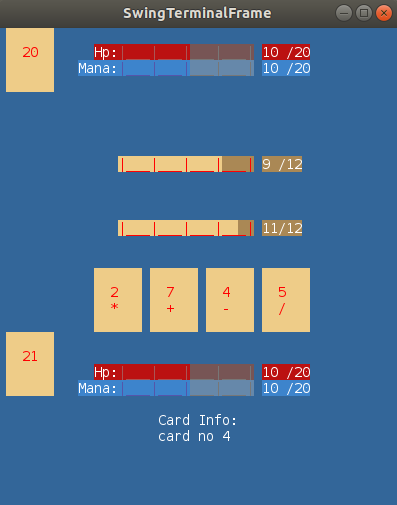

# VOID TYRANT (card game)

## Descrição

Neste jogo, o utilizador joga contra o computador. Tem dois decks à sua disposição: um de cartas normais (com valores a variar de 1 a 6) e outro com cartas que possuem habilidades especiais. Cada jogador tem três barras indicatórias do nível de vida, mana e pontuação da ronda atual.

Em cada ronda a pontuação é inicializada a 0. O objetivo do jogador é ir retirando cartas do baralho normal, cujos valores vão sendo adicionados à pontuação do jogador, até ter uma pontuação mais próxima do nível máximo. Caso tenha uma pontuação superior ao nível máximo, esta é alterada para metade do valor máximo.

No final de cada ronda é efetuado o cálculo da diferença das pontuações de cada jogador, atancando o jogador que possua maior pontuação, um número de vezes correspondente a essa difrença.
Durante cada ronda cada jogador pode ativar cartas especiais, desde que tenha mana para tal, sendo a sua ação ativada de imediato ou no final da ronda (dependendo do seu efeito).

O jogo termina quando a vida de um dos jogadores atingir o valor 0.

