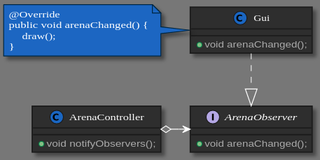
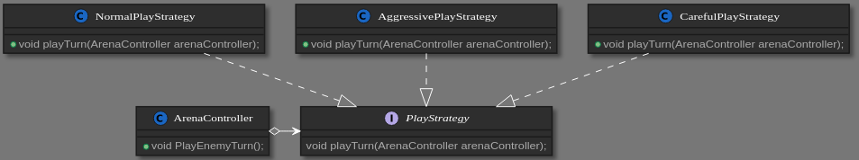

# LPOO_13 - VOID TYRANT (card game)

Este projeto tem como inspiração o jogo "Void Tyrant", onde o utilizador tem como objetivo derrotar um enimigo, utilizando as cartas que tem ao seu dispor. 
Ambos os participantes possuem dois baralhos: um baralho de cartas normais e um baralho de cartas especiais cujas habilidades poderão ser ativadas com o decorrer do jogo.

As cartas normais possuem valores entre 1 a 6 e cada jogador tem como objetivo ir tirando cartas do baralho até que o valor somado das cartas retiradas esteja o mais próximo possível de 12.
Quando ambos os jogadores derem o seu turno por terminado, ataca o jogador com pontuação mais próxima de 12, um número de vezes correspondente à diferença de pontuações.

A ser desenvolvido por [João Cardoso](https://github.com/joaoalc) (up201806531@fe.up.pt) e [João Romão](https://github.com/TsarkFC) (up201806779@fe.up.pt).

## Features implementadas

 - Atualmente, o jogador e o computador podem fazer draw de cartas do baralho normal, há deteção de overflow do draw.
 
 - O computador pode apresentar, neste momento, três "personalidades" distintas:
    - Normal: Faz draw de cartas até ter 9 ou mais pontos;
    - Cuidadosa: Faz draw de cartas até ter 7 ou mais pontos;
    - Agressiva: Faz draw de cartas até ter 9 ou mais pontos, também faz draw se o jogador tiver os mesmos ou mais pontos.
 
 - O utilizador pode obter informação relativa às quatro cartas que tem na "mão" premindo {1, 2, 3, 4}.
 
 - O utilizador pode terminar o seu turno premindo ENTER.
 
 

## Features a implementar

 - Ativação de cartas especiais por parte do utilizador.

 - Ativação de cartas especiais por parte do computador, dependendo da personalidade do mesmo.

 - Cálculo do dano feito/recebido no final de cada turno, dependendo dos pontos e cartas do jogador e inimigo.

 - Existência de vários níveis, onde o computador teria diferentes comportamentos a jogar (mais agressivo, equilibrado, passivo, etc.).
 
 - O jogador vai desbloqueando novas cartas à medida que vai derrotando inimigos.

## Design Patterns

 ### Observer
 
 **Problema:**
 
 Uma vez que o jogo apenas sofre alterações uma vez que o utilizador prima teclas do teclado, seria vantajoso apenas desenhar o jogo ([draw()](../src/main/java/com/g13/view/Gui.java))
 caso a modelo da arena sofresse alterações.
 
 **Design Pattern / Solução**
 
 Uma possível solução seria aplicar o design pattern Observer. Neste design pattern estão presentes vários observadores que executam uma determinada ação apenas quando notificados 
 para tal. 
 
 **Implementação**
 
  
  
  Estas classes podem sem encontradas nos seguintes ficheiros:
  
  - [ArenaController](../src/main/java/com/g13/controller/ArenaController.java)
  
  - [ArenaObserver](../src/main/java/com/g13/controller/observer/ArenaObserver.java)
  
  - [Gui](../src/main/java/com/g13/view/Gui.java)
  
 
 **Consequências**
 
 Apesar de neste momento apenas termos um observador ([Gui](../src/main/java/com/g13/view/Gui.java)), decidimos implementar o design pattern uma vez que será útil no futuro
 quando o código for simplificado e novas componentes forem introduzidas na Arena, não sendo necessária uma atualização contínua de cada compenente da vista do jogo.
 
 #### Command
 
 **Problema:**
 
 No nosso código, existem certas ações que são genéricas (Exemplo: Fazer draw de cartas ou shuffle de um dos decks). Estas ações podem acontecer em várias situações. (Ambos o jogador e o inimigo podem fazer draw, o deck faz shuffle quando as cartas acabam ou, no futuro, possivelmente pelo efeito de alguma carta)
 
 Isto envolve repetição desnecessária de código.
 
 **Design pattern / solução:**
 
 Este design pattern permite fazermos um comando genérico que faz a ação que queremos. Quando precisarmos de executar a ação, chamamos a classe do comando e depois chamamos a função execute.
 
 No nosso código, existe a interface Command, que é implementada pelo DeskShuffler, o DrawCardCommand, entre outros. Onde é necessário executar uma dessas ações comuns, cria-se e executa-se o comando respetivo.
 
 #### Strategy
 
 **Problema:**
 
  Após implementarmos a possibilidade do inimigo fazer draw do seu deck principal, achamos que seria mais interessante se diferentes inimigos reagissem a certas situações de maneiras diferentes.
  
  Isso envolve ter um conjunto expansível de códigos diferentes, todos relativamente complicados, para todas as estratégias. Todos esses códigos são aplicados nas mesmas circunstâncias (No turno do oponente). Se colocassemos um switch case para as diferentes estratégias, acabariamos com um método extremamente "bloated".
  
 **Design Pattern / solução:**
 
 Podemos usar o padrão "Strategy" para corrigir o problema.
  
  Este padrão envolve termos uma interface, que tem uma função para "executar" a função da estratégia. Quando se quer adicionar uma estratégia, cria-se uma classe que implementa essa função. Sendo assim, pode-se associar uma estratégia de jogo a um inimigo e executá-la quando for necessário (Neste caso, no turno do inimigo).
  
  **Implementação**
  
  
  
  Estas classes podem sem encontradas nos seguintes ficheiros:
  
  - [NormalPlayStrategy](../src/main/java/com/g13/controller/strategies/NormalPlayStrategy.java)
  
  - [AggressivePlayStrategy](../src/main/java/com/g13/controller/strategies/AggressivePlayStrategy.java)
  
  - [CarefulPlayStrategy](../src/main/java/com/g13/controller/strategies/CarefulPlayStrategy.java)
  
  - [PlayStrategy](../src/main/java/com/g13/controller/strategies/PlayStrategy.java)
  
  - [ArenaController](../src/main/java/com/g13/controller/ArenaController.java)
  
  **Consequências**
  
  Reduzimos exponencialmente o número de classes necessárias para os inimigos. Isto acontece pois já não é necessária uma subclasse do inimigo para cada estratégia diferente por cada tipo de inimigo. O código também fica mais legível e mais facilmente expansível.
  
## Code Smells e possíveis Refactorings

 ### Long parameter list
 
 - O [construtor de GameParticipant](../src/main/java/com/g13/model/GameParticipant.java) está neste momento longo comparado com o pretendido. O método de refactoring a utilizar seria *Introduce Parameter Object*, que poderia ser introduzido criando um objeto Bar que contesse os valores atuais e máximos.
   Este objeto faria parte do modelo e no futuro viria a ter um controlador que o manipulasse. Já apresenta uma vista que no entanto é controlada pela vista do GameParticipant.

 - O mesmo acontece para alguns métodos presentes em [BarViewer](../src/main/java/com/g13/view/BarViewer.java). Muitos deles devem-se à razão apresentada em cima, mas por outro lado poder-se-ia também, recorrendo ao mesmo refactoring,
   criar uma nova classe Position que evitasse a repetição dos parametros (int x, int y) não só neste momemnto, mas também ao longo de todo o programa.

 ### Lazy Class
 
 - [CardController](../src/main/java/com/g13/controller/CardController.java) e [SpecialCardController](../src/main/java/com/g13/controller/SpecialCardController.java)
 não apresentam muita utilidade ao programa neste momento, uma vez que poucas instruções podem ser aplicadas a uma só carta. Deste modo no futuro poder-se-á criar
 um classe DeckController que manipulasse os baralhos dos jogadores, substituindo estas classes e alguns dos métodos de [GameParticipantController](../src/main/java/com/g13/controller/GameParticipantController.java).

 ### Switch statement
 
 - Numa fase inicial do desenvolvimento tínhamos implementado o design pattern Command, numa altura em que a arquitetura
 MVC não era respeitada e o modelo possuía a capacidade de se modelar. A classe [Gui](../src/main/java/com/g13/view/Gui.java) 
 era reponsável por enviar ao [ArenaController](../src/main/java/com/g13/controller/ArenaController.java) um comando 
 dependendo da tecla que o utilizador premisse. 
 
 - Isto passou a constituir problema quando os métodos que alteram o modelo foram
 tranferidos para controladores, deixando a vista de ter acesso a métodos que moldam o modelo.
 
 - Pensámos em aplicar o design pattern Singleton, numa fase inicial, mas relembrando o que nos foi transmitido
 em diversas aulas, este design pattern poderia provocar mais problemas futuramente.
 
 - Optou-se por criar uma enumeração em [Gui](../src/main/java/com/g13/view/Gui.java), onde cada atributo representa
 um comando a ser executado por [start()](../src/main/java/com/g13/controller/CardController.java) em ArenaController.
 Para reconhecer o atributo utiliza-se uma cadeia de ifs.
 
 - Apesar de constituir um code smell, este apresenta-se neste caso como uma solução a um problema encontrado.

## Testes

 - Screenshot test coverage
 
 - Mutation testing (pitest) link

