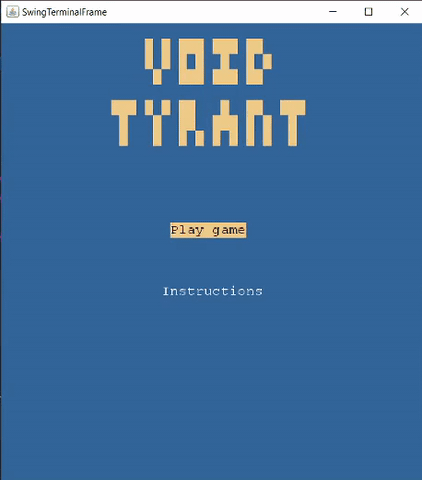
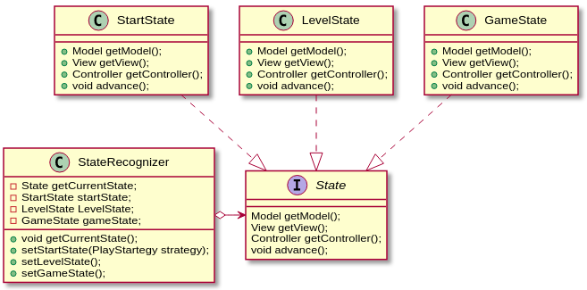
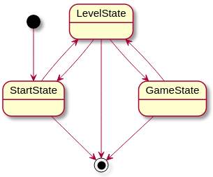

# LPOO_13 - VOID TYRANT (card game)

Este projeto tem como inspiração o jogo "Void Tyrant", onde o utilizador tem como objetivo derrotar um inimigo, utilizando as cartas que tem ao seu dispor. 
Ambos os participantes possuem dois baralhos: um baralho de cartas normais e um baralho de cartas especiais cujas habilidades poderão ser ativadas com o decorrer do jogo.

As cartas normais possuem valores entre 1 a 6 e cada jogador tem como objetivo ir tirando cartas do baralho até que o valor somado das cartas retiradas esteja o mais próximo possível de 12.
Quando ambos os jogadores derem o seu turno por terminado, ataca o jogador com pontuação mais próxima de 12, um número de vezes correspondente à diferença de pontuações.

As diversas cartas especiais que cada jogador possui ao seu dispor podem ser utilizadas sempre que o jogador possuir mana para tal, sendo que o jogador tem na "mão" apenas as primeiras quatro cartas do baralho.

Desenvolvido por [João Cardoso](https://github.com/joaoalc) (up201806531@fe.up.pt) e [João Romão](https://github.com/TsarkFC) (up201806779@fe.up.pt).

## Features implementadas
 - Numa fase incial do jogo o utilizador pode selecionar o menu Instructions onde lhe serão apresentadas instruções iniciais de como jogar o jogo.

Menu inicial | Intruções de jogo
 :--------------:|:---------------:
  | 

 - O computador apresenta, neste momento, três "personalidades" distintas:
    - Cuidadosa: Faz draw de cartas até ter 6 ou mais pontos;
    - Normal: Faz draw de cartas até ter 7 ou mais pontos;
    - Agressiva: Faz draw de cartas até ter 8 ou mais pontos, também faz draw se o jogador tiver os mesmos ou mais pontos.
 
 - O jogador começa inicialmente por defrontar o enimigo com personalidade cuidadosa encontrando-se os restantes inimigos bloqueados. O jogador tem assim como objetivo derrotar os três inimigos sendo que cada vez que derrota um novo inimigo o próximo é desbloqueado.

  Estado inicial do jogo | Estado após o utilizador ter completado o jogo
 :--------------:|:---------------:
  | 

 - O jogador e o computador podem fazer draw de cartas do baralho normal, há deteção de overflow do draw.

 - O utilizador pode terminar o seu turno premindo ENTER.
 
 Início da ronda | Fim de uma ronda
 :--------------:|:---------------:
  | 

 - O utilizador pode obter informação relativa às quatro cartas que tem na "mão" premindo {1, 2, 3, 4}, uma vez selecionada a carta pode ser ativada premindo TAB. Premindo novamente {1, 2, 3, 4} a carta deixa de se encontrar selecionada.

 Exemplo de seleção de carta |
 :--------------:|
  |

## Features que gostaríamos de implementar

 - Gostaríamos de ter criado um baralho de cartas especiais mais completo com as cartas que constam no jogo real Void Tyrant. No entanto teríamos que introduzir uma nova situação em que o computador jogaria cada carta na estrtégia do inimigo, pelo que optámos por ter um baralho mais simples com oito cartas especiais.

 - Dentro da mesma linha, gostaríamos que o acesso a algumas cartas apenas fosse desbloqueado quando o jogador desbloqueasse uma nova etapa do jogo.
 
 - Uma vez que apenas criámos três inimigos distintos, a criação de um menu dinâmico, anteriormente referido como feature planeada,  onde o utilizador se fosse deslocando num mapa acabou por se demonstrar desnecessário, pelo que optámos por um menu mais simples já anteriormente apresentado.

  | Mapa ilustrativo de como o utilizador se poderia movimentar (baseado no jogo SuperTux)
  :---------------:
    |
  

## Design Patterns

 #### State

 **Problema:**

  Um dos objetivos do trabalho era seguir o padrão arquitetural Model-View-Controller (MVC). Inicialmente a nossa preocupação fundamental foi ter um jogo funcional que seguisse o padrão arquitetural. Uma vez conseguido este objetivo começámos a elaboração do código dos menus, tentando manter ao máximo a estrutura do código já desenvolvido.

  **Design Pattern /solução:**

  Perante este problema decidimos implementar o State design pattern, passsando o programa a ser contituido por três estados essenciais:
   
   - [StartState](../src/main/java/com/g13/state/StartState.java): estado inicial do programa em que o utilizador pode ver as instruções de jogo e avançar para o menu de escolha de nível;

   - [LevelState](../src/main/java/com/g13/state/LevelState.java): estado em que o utilizador pode escolher o inimigo contra o qual pretende jogar;

   - [GameState](../src/main/java/com/g13/state/GameState.java): estado em que o utilizador defronta o inimigo sendo redirecionado para o menu de escolha de níveis no final do jogo.

   Uma vez que cada estado tem componentes totalmente distintas assim como formas de as manipular e visualizar, cada estado tem os seus pŕoprios modelo, vista e controlador, sendo que cada um deles implementa uma interface [Model](../src/main/java/com/g13/model/Model.java), [View](../src/main/java/com/g13/view/View.java) e [Controller](../src/main/java/com/g13/controller/Controller.java).

   Como queríamos que cada estado de jogo fosse inicializado uma vez e também de modo a simplificar o código do progama criámos a classe [StateRecognizer](../src/main/java/com/g13/state/StateRecognizer.java) que contém um objeto representativo de cada estado e o estado atual do jogo.

   **Implementação**

  
  
  Estas classes podem sem encontradas nos seguintes ficheiros:
  
  - [State](../src/main/java/com/g13/state/State.java)
  
  - [StateRecognizer](../src/main/java/com/g13/state/StateRecognizer.java)
  
  - [StartState](../src/main/java/com/g13/state/StartState.java)
  
  - [LevelState](../src/main/java/com/g13/state/LevelState.java)
  
  - [GameState](../src/main/java/com/g13/state/GameState.java)

  **Máquina de estados**

  

  **Consequências**

  Ao atribuirmos diversos estados ao jogo permitui-nos, como já foi referido, conservar o código já desenvolvido anteriormente à etapa de desenvolvimento de menus e para além disso facilitou a aplicação do MVC bem como o "Game loop" que será descrito a seguir.

 #### Game Loop (conjugação de MVC com State design pattern)

 **Problema:**

 Após a implementação de menus o jogo passou a ter vários loops que se encontravam em [ArenaController](../src/main/java/com/g13/controller/arena/ArenaController.java), [MenuController](../src/main/java/com/g13/controller/menus/MenuController.java) . Estes dois loops dificultavam os testes das respetivas classes e podiam facilmente concentrar-se num só.

 **Design Pattern / solução:**

 A solução encontrada apresenta-se associada ao State design pattern e ao MVC e passou por condensar os loops em [Game](../src/main/java/com/g13/Game.java):

  | Loop genérico    | Solução adaptada | 
  | :---        |    :----   | 
  | while (true){ &nbsp;&nbsp;processInput(); &nbsp;&nbsp;update(); &nbsp;&nbsp;render(); } | 

Neste caso o processamento do input do utilizador e a atulização do jogo são ambos realizados pela função start(). Uma vez que o jogo apenas avança com o input do utilizador não foi necessário o controlo da frequência de atualização dos frames da aplicação.
 
 **Implementação:**

 #### Strategy
 
 **Problema:**
 
  Após implementarmos a possibilidade do inimigo fazer draw do seu deck principal, achamos que seria mais interessante se diferentes inimigos reagissem a certas situações de maneiras diferentes.
  
  Isso envolve ter um conjunto expansível de códigos diferentes, todos relativamente complicados, para todas as estratégias. Todos esses códigos são aplicados nas mesmas circunstâncias (No turno do oponente). Se colocassemos um switch case para as diferentes estratégias, acabariamos com um método extremamente "bloated".
  
 **Design Pattern / solução:**
 
 Podemos usar o padrão "Strategy" para corrigir o problema.
  
  Este padrão envolve termos uma interface, que tem uma função para "executar" a função da estratégia. Quando se quer adicionar uma estratégia, cria-se uma classe que implementa essa função. Sendo assim, pode-se associar uma estratégia de jogo a um inimigo e executá-la quando for necessário (Neste caso, no turno do inimigo).
  
  **Implementação**
  
  
  
  Estas classes podem sem encontradas nos seguintes ficheiros:
  
  - [NormalPlayStrategy](../src/main/java/com/g13/controller/arena/strategies/NormalPlayStrategy.java)
  
  - [AggressivePlayStrategy](../src/main/java/com/g13/controller/arena/strategies/AggressivePlayStrategy.java)
  
  - [CarefulPlayStrategy](../src/main/java/com/g13/controller/arena/strategies/CarefulPlayStrategy.java)
  
  - [PlayStrategy](../src/main/java/com/g13/controller/arena/strategies/PlayStrategy.java)
  
  - [ArenaController](../src/main/java/com/g13/controller/arena/ArenaController.java)
  
  **Consequências**
  
  Reduzimos exponencialmente o número de classes necessárias para os inimigos. Isto acontece pois já não é necessária uma subclasse do inimigo para cada estratégia diferente por cada tipo de inimigo. O código também fica mais legível e mais facilmente expansível.
  
## Code Smells e possíveis Refactorings

 ### Lazy Class
 
 

 ### Switch statement
 
 - Numa fase inicial do desenvolvimento tínhamos implementado o design pattern Command, numa altura em que a arquitetura
 MVC não era respeitada e o modelo possuía a capacidade de se modelar. A classe [Gui](../src/main/java/com/g13/view/Gui.java) 
 era reponsável por enviar ao [ArenaController](../src/main/java/com/g13/controller/arena/ArenaController.java) um comando 
 dependendo da tecla que o utilizador premisse. 
 
 - Isto passou a constituir problema quando os métodos que alteram o modelo foram
 tranferidos para controladores, deixando a vista de ter acesso a métodos que moldam o modelo.
 
 - Pensámos em aplicar o design pattern Singleton, numa fase inicial, mas relembrando o que nos foi transmitido em diversas aulas, este design pattern poderia provocar mais problemas futuramente.
 
 - Optou-se por criar uma enumeração em [ArenaViewer](../src/main/java/com/g13/view/arena/ArenaViewer.java), onde cada atributo representa
 um comando a ser executado por [start()](../src/main/java/com/g13/controller/Controller.java) em Controller (implementação distinta para cada estado).
 Para reconhecer o atributo utiliza-se uma cadeia de ifs.
 
 - Apesar de constituir um code smell, este apresenta-se neste caso como uma solução a um problema encontrado.

## Testes
 
 ### Coverage testing
 
 
 
 - Coverage testing [link](./tests).
 
 ### Mutation testing 
 
 
 
 - Mutation testing [link](./mutation).
 
## Autoavaliação
 Ambos os membros trabalharam de igual forma na execução do trabalho.
 - João Cardoso: 50%
 - João Romão: 50%

