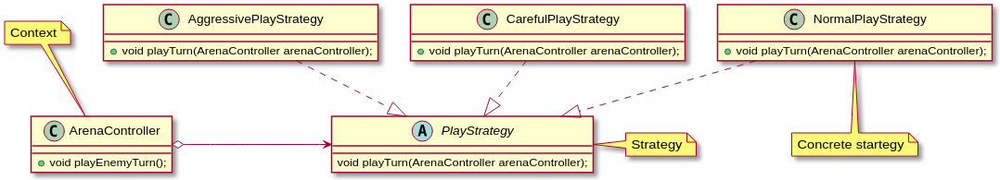

# LPOO_13 - VOID TYRANT (card game)

Este projeto tem como inspiração o jogo "Void Tyrant", onde o utilizador tem como objetivo derrotar um inimigo, utilizando as cartas que tem ao seu dispor. 
Ambos os participantes possuem dois baralhos: um baralho de cartas normais e um baralho de cartas especiais cujas habilidades poderão ser ativadas com o decorrer do jogo.

As cartas normais possuem valores entre 1 a 6 e cada jogador tem como objetivo ir tirando cartas do baralho até que o valor somado das cartas retiradas esteja o mais próximo possível de 12.
Quando ambos os jogadores derem o seu turno por terminado, ataca o jogador com pontuação mais próxima de 12, um número de vezes correspondente à diferença de pontuações.

As diversas cartas especiais que cada jogador possui ao seu dispor podem ser utilizadas sempre que o jogador possuir mana para tal, sendo que o jogador tem na "mão" apenas as primeiras quatro cartas do baralho.

Desenvolvido por [João Cardoso](https://github.com/joaoalc) (up201806531@fe.up.pt) e [João Romão](https://github.com/TsarkFC) (up201806779@fe.up.pt).

## Features implementadas
 - Numa fase incial do jogo o utilizador pode selecionar o menu Instructions onde lhe serão apresentadas instruções iniciais de como jogar o jogo.

Menu inicial | Intruções de jogo
 :--------------:|:---------------:
  | 

 - O computador apresenta, neste momento, três "personalidades" distintas:
    - Cuidadosa: Faz draw de cartas até ter 6 ou mais pontos;
    - Normal: Faz draw de cartas até ter 7 ou mais pontos;
    - Agressiva: Faz draw de cartas até ter 8 ou mais pontos, também faz draw se o jogador tiver os mesmos ou mais pontos.
 
 - O jogador começa inicialmente por defrontar o enimigo com personalidade cuidadosa encontrando-se os restantes inimigos bloqueados. O jogador tem assim como objetivo derrotar os três inimigos sendo que cada vez que derrota um novo inimigo o próximo é desbloqueado.

  Estado inicial do jogo | Estado após o utilizador ter completado o jogo
 :--------------:|:---------------:
  | 

 - O jogador e o computador podem fazer draw de cartas do baralho normal, há deteção de overflow do draw.

 - O utilizador pode terminar o seu turno premindo ENTER.
 
 Início da ronda | Fim de uma ronda
 :--------------:|:---------------:
  | 

 - O utilizador pode obter informação relativa às quatro cartas que tem na "mão" premindo {1, 2, 3, 4}, uma vez selecionada a carta pode ser ativada premindo TAB. Premindo novamente {1, 2, 3, 4} a carta deixa de se encontrar selecionada.

 Exemplo de seleção de carta |
 :--------------:|
  |

## Features que gostaríamos de implementar

 - Gostaríamos de ter criado um baralho de cartas especiais mais completo com as cartas que constam no jogo real Void Tyrant. No entanto teríamos que introduzir uma nova situação em que o computador jogaria cada carta na estrtégia do inimigo, pelo que optámos por ter um baralho mais simples com oito cartas especiais.

 - Dentro da mesma linha, gostaríamos que o acesso a algumas cartas apenas fosse desbloqueado quando o jogador desbloqueasse uma nova etapa do jogo.
 
 - Uma vez que apenas criámos três inimigos distintos, a criação de um menu dinâmico, anteriormente referido como feature planeada,  onde o utilizador se fosse deslocando num mapa acabou por se demonstrar desnecessário, pelo que optámos por um menu mais simples já anteriormente apresentado.

  | Mapa ilustrativo de como o utilizador se poderia movimentar (baseado no jogo SuperTux)
  :---------------:
    |
  

## Design Patterns
 
 #### Strategy
 
 **Problema:**
 
  Após implementarmos a possibilidade do inimigo fazer draw do seu deck principal, achamos que seria mais interessante se diferentes inimigos reagissem a certas situações de maneiras diferentes.
  
  Isso envolve ter um conjunto expansível de códigos diferentes, todos relativamente complicados, para todas as estratégias. Todos esses códigos são aplicados nas mesmas circunstâncias (No turno do oponente). Se colocassemos um switch case para as diferentes estratégias, acabariamos com um método extremamente "bloated".
  
 **Design Pattern / solução:**
 
 Podemos usar o padrão "Strategy" para corrigir o problema.
  
  Este padrão envolve termos uma interface, que tem uma função para "executar" a função da estratégia. Quando se quer adicionar uma estratégia, cria-se uma classe que implementa essa função. Sendo assim, pode-se associar uma estratégia de jogo a um inimigo e executá-la quando for necessário (Neste caso, no turno do inimigo).
  
  **Implementação**
  
  
  
  Estas classes podem sem encontradas nos seguintes ficheiros:
  
  - [NormalPlayStrategy](../src/main/java/com/g13/controller/strategies/NormalPlayStrategy.java)
  
  - [AggressivePlayStrategy](../src/main/java/com/g13/controller/strategies/AggressivePlayStrategy.java)
  
  - [CarefulPlayStrategy](../src/main/java/com/g13/controller/strategies/CarefulPlayStrategy.java)
  
  - [PlayStrategy](../src/main/java/com/g13/controller/strategies/PlayStrategy.java)
  
  - [ArenaController](../src/main/java/com/g13/controller/ArenaController.java)
  
  **Consequências**
  
  Reduzimos exponencialmente o número de classes necessárias para os inimigos. Isto acontece pois já não é necessária uma subclasse do inimigo para cada estratégia diferente por cada tipo de inimigo. O código também fica mais legível e mais facilmente expansível.
  
## Code Smells e possíveis Refactorings

 ### Long parameter list
 
 - O [construtor de GameParticipant](../src/main/java/com/g13/model/GameParticipant.java) está neste momento longo comparado com o pretendido. O método de refactoring a utilizar seria *Introduce Parameter Object*, que poderia ser introduzido criando um objeto Bar que contesse os valores atuais e máximos (health e max_health por exemplo).
   Este objeto faria parte do modelo e no futuro viria a ter um controlador que o manipulasse. Já apresenta uma vista que no entanto é controlada pela vista do GameParticipant.

 - O mesmo acontece para alguns métodos presentes em [BarViewer](../src/main/java/com/g13/view/BarViewer.java). Muitos deles devem-se à razão apresentada em cima, mas por outro lado poder-se-ia também resolver recorrendo ao mesmo refactoring,
   criar uma nova classe Position que evitasse a repetição dos parametros (int x, int y) não só neste momemnto, mas também ao longo de todo o programa.

 ### Lazy Class
 
 - [CardController](../src/main/java/com/g13/controller/CardController.java) e [SpecialCardController](../src/main/java/com/g13/controller/SpecialCardController.java)
 não apresentam muita utilidade ao programa neste momento, uma vez que poucas instruções podem ser aplicadas a uma só carta. Deste modo no futuro poder-se-á criar
 um classe DeckController que manipulasse os baralhos dos jogadores, substituindo estas classes e alguns dos métodos de [GameParticipantController](../src/main/java/com/g13/controller/GameParticipantController.java).

 ### Switch statement
 
 - Numa fase inicial do desenvolvimento tínhamos implementado o design pattern Command, numa altura em que a arquitetura
 MVC não era respeitada e o modelo possuía a capacidade de se modelar. A classe [Gui](../src/main/java/com/g13/view/Gui.java) 
 era reponsável por enviar ao [ArenaController](../src/main/java/com/g13/controller/ArenaController.java) um comando 
 dependendo da tecla que o utilizador premisse. 
 
 - Isto passou a constituir problema quando os métodos que alteram o modelo foram
 tranferidos para controladores, deixando a vista de ter acesso a métodos que moldam o modelo.
 
 - Pensámos em aplicar o design pattern Singleton, numa fase inicial, mas relembrando o que nos foi transmitido
 em diversas aulas, este design pattern poderia provocar mais problemas futuramente.
 
 - Optou-se por criar uma enumeração em [Gui](../src/main/java/com/g13/view/Gui.java), onde cada atributo representa
 um comando a ser executado por [start()](../src/main/java/com/g13/controller/CardController.java) em ArenaController.
 Para reconhecer o atributo utiliza-se uma cadeia de ifs.
 
 - Apesar de constituir um code smell, este apresenta-se neste caso como uma solução a um problema encontrado.

## Testes

 Na realização dos testes focámo-nos mais em classes que à partida sofrerão poucas ou nenhumas alterações (ex. modelo).
 
 Classes que fazem parte de strategies não possuem testes, uma vez que são features em desenvolvimento e recentemente implementadas.
 
 ArenaController possui também poucos testes uma vez que irá sofrer algumas alterações
 quando for implementada a transição entre turnos de jogo.
 
 ### Coverage testing
 
 
 
 - Coverage testing [link](./tests).
 
 ### Mutation testing 
 
 
 
 - Mutation testing [link](./mutation).
 
## Autoavaliação
 Ambos os membros trabalharam de igual forma na execução do trabalho.
 - João Cardoso: 50%
 - João Romão: 50%

